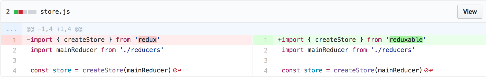
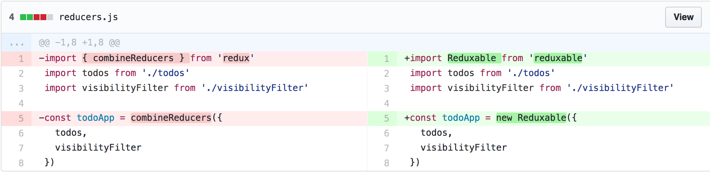
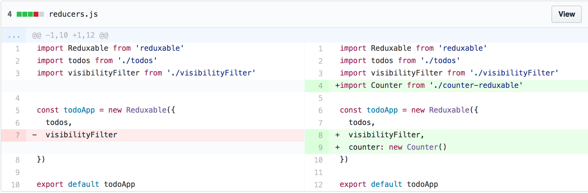

# Reduxable

Reusable Redux **without boilerplate**

It's strongly based on Redux so you should know how Redux works before start using this library.

## Sections
* [Installation](#installation)
* [Motivation](#motivation)
* [What is Reduxable?](#what-is-reduxable)
* [Integration](#integration)
* [Usage](#usage)
* [FAQ](#faq)
* [Examples](#examples)

### Installation

To install the stable version:

```bash
$ npm install --save reduxable
```
or with Yarn
```bash
$ yarn add reduxable
```

### Motivation

Redux is great! It solves a really hard problem: **state managament**.

And it does it in an simple, easy to understand way, based in the following principles:

> The whole state of your app is stored in an object tree inside a single *store*.

> The only way to change the state tree is to emit an *action*, an object describing what happened.

> To specify how the actions transform the state tree, you write pure *reducers*.


This comes with a lot of benefits in terms of simplicity and tools, specially **great tools**.

But there are some issues that Redux does not solve:

- It's really difficult to reuse the code due to the global scope: the action types could collide
- We need to create a lot of boilerplate even for a tiny feature

Reduxable tackle both problems and aims to do it in an elegant way, **always honoring the 3 Redux principles** so we can keep using most of the tools we already have for Redux.

### What is Reduxable
Reduxable is a library for creating reusable _state components_. We're convinced that thinking in components is very important; we love React for that reason: you end up with a more robust and easy to understand code. Reduxable enforces you to think this way for the state too.

All you need to care about is what really matters, the real logic: the state, the reducers and some selectors and methods to do async stuffs.

Internally each action has a `scope` and each reducer will check for it. Also you can access to the state using `.state` which will give you the portion of the state for this _state component_.

### Integration
Since Reduxable is fully compatible with Redux, we recommend you to integrate it first and check everything is working well before start creating your Reduxable _state components_.

#### With Redux

If you're already using Redux you must follow this two easy steps:
  
  1. In the file you create the store, import `createStore` from `reduxable` instead of `redux`.
  
  
  2. In the file you combine all the reducers, replace `combineReducers({...})` by `new Reduxable({...})`.
  
  

Finally check everything is still working and then add your new reduxable to the _**main reduxable**_ (see how to create a Counter Reduxable)



#### If you're starting from scratch
Import `createStore` from `reduxable` in the file you create the store.
```js
import { createStore } from 'reduxable'
import mainReduxable from './reduxables'

const store = createStore(mainReduxable)
```

Create a main file where you will combine all your reduxables (in this case `reduxables/index.js`)
```js
import Reduxable from 'reduxable'
import Counter from './counter-reduxable'

const myApp = new Reduxable({
  counter: new Counter()
})

export default myApp
```

### Usage
#### Creating a basic Reduxable
For a Reduxable you just need to define the initial `state` and the `reducers`. They are _statics_ so that can be reused across all the instances.
```js
import Reduxable from 'reduxable'

const reducers = {
  increment: (state) => state + 1,
  decrement: (state) => state - 1,
}

class Counter extends Reduxable {
  constructor() {
    super(0, reducers)
  }
}

export default Counter
```

To use it just import it and create a new instance
```js
import Counter from './counter'
const newCounter = new Counter()
```

Get the state of that counter using `state`
```js
newCounter.state // => 0
```

Call the reducers as methods. The state will be bound internally, as Redux does.
```js
newCounter.reducers.increment()
newCounter.state // => 1
```

#### Reducers alias
It's easy to define alias for the reducers so, for example, you call `counter.increment()` instead of `counter.reducers.increment()`. We prefer not to do it automatically to avoid _too magic_ stuff.
```js
class Counter extends Reduxable {
  constructor() {
    super(0)
  }

  static reducers = {
    increment: state => state + 1
  }

  increment = () => this.reducers.increment()
}
```

#### Selectors
Selectors are easier than ever. Taking advantage on Reduxable `state` method that will give you the scoped state you can define them as simple methods.
```js
class DeepState extends Reduxable {
  constructor() {
    super({
      some: {
        deep: {
          data: 'Gold'
        }
      }
    })
  }

  static reducers = {
    ...
  }

  getDeepData = () => {
    return this.state.some.deep.data
  }
}

const deepState = new DeepState()
deepState.getDeepData() // => 'Gold'
```

#### Reducers with payload
The reducers have the following signature `reducer(state, payload)` where the payload can be any primitive type or plain object/array. You can pass a payload to your reducer calling the method with a parameter.

```js
class Counter extends Reduxable {
  constructor() {
    super(0)
  }

  static reducers = {
    add: (state, n) => state + n,
    addAll: (state, numbers) => state + numbers.reduce((sum, n) => sum + n)
  }
}

const newCounter = new Counter()
newCounter.reducers.add(50)
newCounter.reducers.addAll([10, 10, 30])
```

#### Global reducers
The reducers have the following signature `reducer(state, payload)` where the payload can be any primitive type or plain object/array. You can pass a payload to your reducer calling the method with a parameter.

```js
class Counter extends Reduxable {
  constructor() {
    super(0)
  }

  static reducers = {
    increment: state => state + 1
  }

  static globalReducers = {
    OLD_REDUX_ACTION: state => 1000
  }
}

const newCounter = new Counter()
// The OLD_REDUX_ACTION reducer will be called if an action with type `OLD_REDUX_ACTION` is dispatched
dispatch({ type: 'OLD_REDUX_ACTION' })
newCounter.state // => 1000
```

#### Async actions
If you want an _async action creator_ you can easily do it as a method that internally will call a reducer. You don't need any middleware, just use `promises` or `async/await` and then call your reducers.

```js
import Reduxable from 'reduxable'

class Counter extends Reduxable {
  constructor() {
    super(0)
  }

  static reducers = {
    increment: (state) => state + 1,
    decrement: (state) => state - 1,
  }

  incrementWithPromises = () => {
    fetch('http://should-increment')
      .then(() => this.reducers.increment())
      .catch(() => this.reducers.decrement())
  }

  incrementWithAsyncAwait = async () => {
    try {
      await fetch('http://should-increment')
      this.reducers.increment()
    } catch() {
      this.reducers.decrement()
    }
  }
}

const newCounter = new Counter()
newCounter.incrementWithPromises()
newCounter.incrementWithAsyncAwait()
```

### FAQ
#### Can I use the Redux Dev-Tools and other middlewares/enhancers?
Yes. Since Reduxable uses Redux internally and holds the 3 Redux principles, most of the middlewares and enhancers will work out of the box.
If you find one that doesn't please create an issue.

### Examples

* [Counter](https://github.com/underscopeio/reduxable/tree/master/examples/counter)
* [Todos](https://github.com/underscopeio/reduxable/tree/master/examples/todos)
* [Multiple Todos](https://github.com/underscopeio/reduxable/tree/master/examples/multiple-todos)

### Change Log

This project adheres to [Semantic Versioning](http://semver.org/).
Every release, along with the migration instructions, is documented on the Github [Releases](https://github.com/underscopeio/reduxable/releases) page.

### License

MIT
